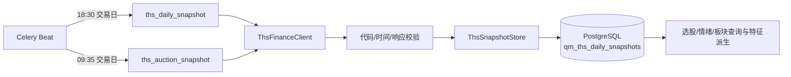

# 同花顺选股、情绪、盘前与板块快照接入方案

## 目标

将同花顺金融数据服务作为 QuantMind 的补充数据源，保存每日可复盘的原始快照，支持：

- 选股：估值快照、报告期财务指标；
- 情绪：涨停池、跌停池、炸板池、连板天梯、热股榜、飙升榜、异动、龙虎榜；
- 盘前：集合竞价终态和短线风向标基准；
- 板块：同花顺概念/行业/地域/特色目录、指数行情、指定指数成分股。

easy_tdx 继续承担实时五档、分钟线、逐笔、资金流和本地技术指标；QuantDB 继续承担研究主数据、完整历史因子和 Qlib 输入。同花顺快照不直接覆盖现有 `stock_daily_latest` 或 `features_daily`，先以独立数据集进入数据平台。

## 数据流



两个任务均由 `backend.services.engine.qlib_app.celery_config` 注册到现有 Qlib Celery worker。默认关闭，配置密钥后显式开启；不会新增独立进程或修改现有行情主链路。

## 存储模型

表：`qm_ths_daily_snapshots`

| 字段 | 说明 |
| --- | --- |
| `snapshot_date` | 上海时区业务日期 |
| `dataset` | 数据集标识，如 `limit_up_pool`、`dragon_tiger_all` |
| `scope_key` | 幂等范围键；内部股票代码如 `SH600519`，市场级响应为 `__market__`；指数成分使用 `index:<指数>:<股票>` |
| `symbol` | 可选内部前缀式股票/指数代码 |
| `as_of_ms` | 上游数据时间；竞价接口的响应组装时间也保留原值 |
| `payload` | 原始业务 JSONB，不在采集层改写数值口径 |
| `source_request_id` | 同花顺 `request_id`，用于追溯 |
| `row_count` | 本次业务响应的总条数 |
| `status` | 当前为 `success`，为后续失败留出状态位 |
| `schema_version` | 当前 `ths_snapshot_v1` |
| `captured_at` | QuantMind 写入时间 |

唯一键为 `(snapshot_date, dataset, scope_key)`。重复执行同一天任务会更新同一行，避免重试产生重复数据；原始 JSON 仍保留字段缺失和 `null`，下游不得把 `null` 补成零。

## 每日采集内容

盘后任务 `engine.tasks.ths_daily_snapshot`：

1. 标的目录：默认从 `meta/tickers/list` 读取 SH/SZ/BJ A 股全市场；配置 `HITHINK_FINANCE_SYMBOLS` 后只采集指定股票。
2. 估值：按最多 100 只一批调用 `valuations/snapshot`，保存 PE TTM/MRQ、PB MRQ、PS TTM、PCF TTM。
3. 情绪专题：分页取尽涨停、跌停、炸板池；保存连板天梯、当日异动、日榜热股、飙升榜、历史热股和龙虎榜全部榜。
4. 板块：保存四类指数目录；对 `HITHINK_FINANCE_INDEX_CODES` 指定指数保存快照和当前成分股。

竞价任务 `engine.tasks.ths_auction_snapshot`：

1. 按同一股票范围分批保存集合竞价终态；
2. 保存 `short-term-benchmark` 的标签与百分比；
3. 运行时间为 09:35，业务日期以 `Asia/Shanghai` 计算。

当前没有把全市场财务指标作为每日任务：它按报告期变化，逐股票请求成本高且不属于日内快照。后续可以单独增加月度/财报披露触发任务，或只对策略候选池采集。

## 环境配置

```dotenv
HITHINK_FINANCE_API_KEY=          # 必填；只放在部署平台 Secret 或 runtime.env
HITHINK_FINANCE_BASE_URL=https://fuyao.aicubes.cn
HITHINK_FINANCE_SNAPSHOT_ENABLED=false
HITHINK_FINANCE_SYMBOLS=          # 空值=全市场；内部格式 SH600519,SZ000001
HITHINK_FINANCE_INDEX_CODES=000300.SH,000001.SH,399001.SZ,399006.SZ
HITHINK_FINANCE_TIMEOUT_SECONDS=20
HITHINK_FINANCE_MAX_RETRIES=3
```

代码格式的边界必须集中在采集器：同花顺请求使用其 `600519.SH` 形式；进入 QuantMind 后统一使用 `StockCodeUtil.to_prefix()` 的 `SH600519` 形式。Redis、数据库字段和 API 响应不允许新增后缀式内部键。

## 失败与重试

- 网络错误、HTTP 5xx、业务 `4001/5xxx`：指数退避，最多 3 次；任务失败由 Celery 延迟重试。
- 认证、参数、无权限和数据未准备 (`1001/1002/1003/1004/2001/2003/3001/3002/3004`)：不重复原请求，任务记录失败并等待下一周期。
- 空业务集合是成功结果，例如非交易日或当日无异动；必须保存空结果的元数据，不能伪造数据。
- 数据库写入采用事务批量 upsert；半批失败时事务回滚，不覆盖上一版有效快照。

## 质量门禁

每天至少检查：

- `snapshot_date` 是否为有效交易日；
- 估值批次是否覆盖标的目录，重复和缺失数量是否在阈值内；
- 三个股票池的分页总数是否等于实际写入行数；
- 热榜是否为预期 Top30；龙虎榜是否保留 `trade_date` 和榜型；
- 竞价响应 `data_status` 是否为 `final`，未就绪时保留状态而不是补零；
- 指数成分属于当前成分快照，不能标记为历史时点成分；
- 上游 `request_id`、采集耗时、失败码和行数可追溯。

回测使用时必须再增加点时约束：估值和财务只能使用披露日已经可见的数据；当前成分股不能直接用于历史成分回测；热榜、龙虎榜和竞价数据需使用对应业务日期，不能按写入时间代替。

## 查询与派生层

第一阶段已经提供原始快照读取和四个薄视图，不把这些动态字段直接混入模型特征。视图只统一元数据，业务指标仍从 `payload` 读取：

- `v_ths_daily_snapshot`：所有同花顺快照的统一入口；
- `v_ths_stock_selection_daily`：估值 + 财务指标 + 标的目录；
- `v_ths_emotion_daily`：涨跌停、炸板、连板、热榜、龙虎榜汇总；
- `v_ths_auction_daily`：竞价涨跌幅、量比、换手率和标签；
- `v_ths_sector_daily`：指数目录、指数快照、成分快照。

视图输出统一采用 `symbol`、`trade_date`、`source`、`as_of_ms`、`is_stale` 等 QuantMind 字段，并将百分数原值、比例、金额和数量按字段级单位映射，禁止全局乘除 100。

管理后台的「数据管理 → 同花顺快照」页签提供独立数据集目录。目录通过管理员接口 `/api/v1/admin/data-platform/ths-snapshots/catalog` 直接统计 PostgreSQL，不加入 QuantDB Parquet 同步清单。点击数据集可按日期、股票代码或名称预览 JSONB 原始字段；接口只读且沿用管理员鉴权。

## 上线步骤

1. 在 PostgreSQL 执行 `backend/shared/db_init.sql` 中新增表段，或让任务首次运行自动建表。
2. 在 worker 和 beat 的 Secret 中配置 `HITHINK_FINANCE_API_KEY`，先保持 `HITHINK_FINANCE_SNAPSHOT_ENABLED=false` 做连接检查。
3. 手动执行：

   ```bash
   HITHINK_FINANCE_API_KEY="$HITHINK_FINANCE_API_KEY" \
     python backend/scripts/ths_daily_snapshot.py
   HITHINK_FINANCE_API_KEY="$HITHINK_FINANCE_API_KEY" \
     python backend/scripts/ths_daily_snapshot.py --auction
   ```

4. 检查 `qm_ths_daily_snapshots` 的业务日期、数据集、行数、`request_id` 和空结果状态。
5. 开启 `HITHINK_FINANCE_SNAPSHOT_ENABLED=true`，重启 `celery-worker` 和 `celery-beat`；首个交易日只做观察，不接入模型训练。
6. 连续运行 5 个交易日，确认覆盖率、失败重试、点时口径和单位后，再基于视图创建选股接口和模型特征。

## 当前实现文件

- `backend/services/engine/data_platform/ths_snapshots.py`：客户端、采集器、JSONB 存储。
- `backend/services/engine/tasks/celery_tasks.py`：两个 Celery 任务。
- `backend/services/engine/qlib_app/celery_config.py`：09:35/18:30 交易日调度。
- `backend/shared/db_init.sql`：快照表和索引。
- `backend/scripts/ths_daily_snapshot.py`：手动运行入口。
- `backend/tests/test_ths_snapshots.py`：代码标准化、路径校验和采集器边界测试。

金融数据服务的代码是 MIT 许可，但数据使用和再分发权限由同花顺账号授权决定。API Key 不得写入 Git、日志、任务参数或命令行历史。
